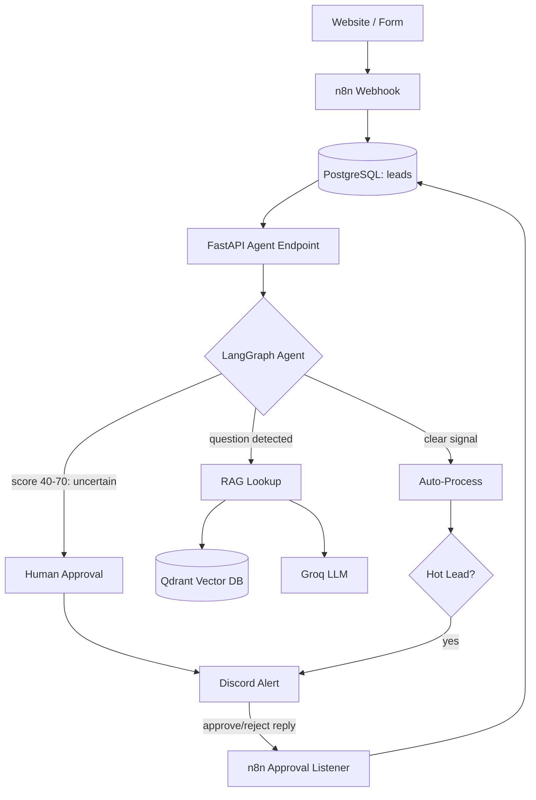
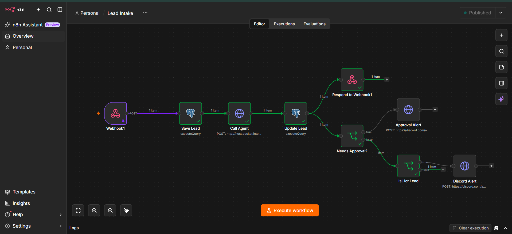

# 🤖 Keyur AI Automation Lab
**Build. Automate. Orchestrate.**

An AI-powered business operations system combining workflow automation, a decision-making AI agent, and a document-grounded RAG knowledge assistant — built to demonstrate real agentic AI engineering, not just API calls chained together.

## What this is

A lead comes in through a webhook. The system saves it, asks an AI agent to evaluate it, and the agent decides what happens next — process it automatically, escalate it for human approval, or consult the company knowledge base before responding. Hot leads and leads needing review get pushed to Discord in real time, and reviewers can approve or reject directly by replying in the channel.

This isn't a demo with hardcoded outputs — the AI agent's scoring, routing decisions, and RAG answers are all live model calls, tested against a real anonymized business dataset (Olist Marketing Funnel, 842 closed deals).

## Architecture



## Core components

### 1. AI Business Operations OS (n8n)
- Webhook-based lead intake with duplicate handling (upsert on email)
- AI-driven lead scoring, categorization (hot/warm/cold), and reasoning
- Real-time Discord alerts for hot leads and leads pending review
- Reply-to-approve workflow: reviewers type `approve <id>` or `reject <id>` in Discord, a scheduled n8n workflow picks it up and updates the database

### 2. RAG Knowledge Brain (FastAPI + Qdrant + Groq)
- Documents chunked, embedded (`fastembed`, local, no API key needed), and stored in Qdrant
- Source-grounded answers — the assistant cites which document it used and says "I don't know" rather than hallucinating when the answer isn't in the knowledge base
- Reasons across multiple documents in a single answer (company SOPs + real dataset insights)

### 3. Decision-Making Agent (LangGraph)
- Not a fixed pipeline — the agent's graph has conditional branches:
  - Score in the 40–70 uncertain band → routed to human approval instead of auto-processing
  - Message contains a question/pricing/policy signal → agent consults the RAG knowledge base and drafts a suggested reply
  - Otherwise → processed automatically
- Built as a real `StateGraph` with conditional edges, not an if/else chain pretending to be an agent

## Tech stack

| Layer | Technology |
|---|---|
| Automation | n8n |
| Backend / Agent | Python, FastAPI, LangGraph |
| LLM | Groq (`openai/gpt-oss-20b`) |
| Embeddings | fastembed (`BAAI/bge-small-en-v1.5`), local, no API cost |
| Vector DB | Qdrant |
| Database | PostgreSQL |
| Alerts / Human-in-the-loop | Discord (webhook + bot) |
| Infrastructure | Docker Compose |

## Project structure

```
backend/              FastAPI service: RAG endpoints + LangGraph agent
├── main.py           API routes (/ingest, /ask, /agent/process-lead)
├── agent.py          LangGraph agent: qualify → route → (approval | RAG | finalize)
├── shared.py         Shared Qdrant + embedding model instances
n8n-workflows/          Exported n8n workflow JSON (lead intake, approval listener)
knowledge-base/         Source documents for the RAG system (FAQ, SOP, real dataset insights)
data/                   Real anonymized dataset used to generate realistic test leads
infra/postgres/         Database schema migrations
docker-compose.yml      Postgres, Qdrant, and the FastAPI backend
```

## Real data, not fake numbers

Test leads were generated from the [Olist Marketing Funnel dataset](https://www.kaggle.com/datasets/olistbr/marketing-funnel-olist) (842 real, anonymized closed deals) rather than invented from scratch — business segment, lead type, and declared revenue were used to build realistic inquiry messages, which the AI agent then scored live. The RAG knowledge base also includes a document with real aggregate statistics computed from this dataset (top business segments, lead type conversion, revenue distribution), so the assistant can answer questions grounded in actual data rather than assumptions.

## Running it locally

```bash
cp .env.example .env      # fill in Postgres password, N8N key, and Groq API key
docker compose up -d postgres qdrant backend
# import n8n-workflows/lead-intake.json and approval-listener.json into your n8n instance
```

| Service | URL |
|---|---|
| n8n | http://localhost:5678 |
| Backend API | http://localhost:8001 |
| Qdrant dashboard | http://localhost:6333/dashboard |

## Status

- [x] Lead intake automation with duplicate handling
- [x] AI-driven lead scoring and categorization
- [x] Discord alerts for hot leads
- [x] RAG knowledge brain with source citations
- [x] LangGraph decision-making agent (approval routing + RAG routing)
- [x] Reply-to-approve human-in-the-loop workflow
- [x] Real dataset integration and grounded insights
- [ ] Portfolio site with "Talk to My Portfolio" assistant (reusing this RAG pipeline)
- [ ] Production deployment

## Screenshots

### n8n Lead Intake Workflow

---

Built by **Keyur Solanki** — n8n · Python · FastAPI · LangGraph · Qdrant · PostgreSQL
